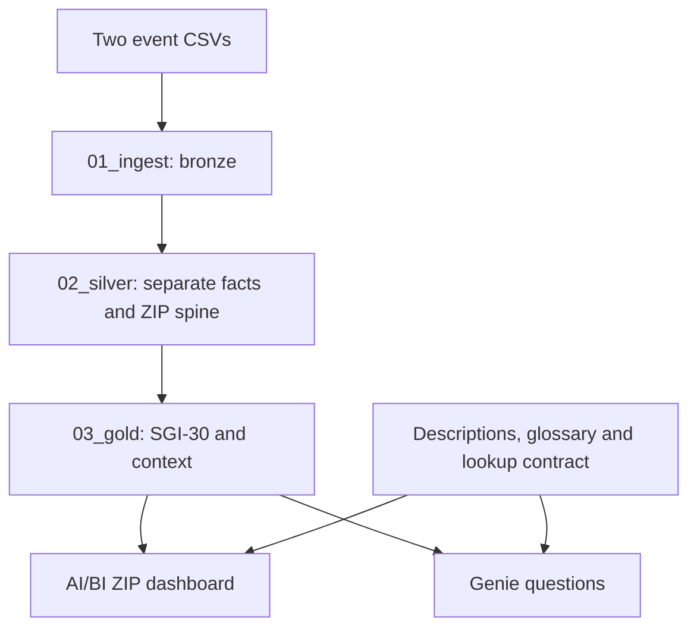

# The 311 Blind Spot

**1st place · Databricks Hackathon @ Queens College 2026 · September 2026**

A Databricks analytics project that helps people explore what NYC 311 complaint counts miss: reporting patterns, concentrated GPS clusters, and gaps in recorded administrative closure.

Our four-person team placed first among nine presenting teams. We presented to an audience that included Databricks Senior Solutions Architects, Senior Solutions Engineers, and WAGMI Tech Events Lead Priyanka Kaur. The team received four Databricks-branded Lululemon backpacks.

[Project on Devpost](https://devpost.com/software/the-311-blind-spot) · [Hackathon](https://databricks-hackathon-2026.devpost.com/)

## The question

When someone reports a rodent problem, what can the public record tell us about what happened next?

A complaint heatmap shows where people reported problems. It does not count rats. A closed ticket records an administrative timestamp. It does not prove that an inspector visited or that a problem was resolved.

The 311 Blind Spot keeps those distinctions visible. Its **Service Gap Index, SGI-30**, measures the share of eligible complaints that lacked a recorded closure within 30 days. ZIP lookup cards place that score beside sample size, reporting patterns, coordinate concentration, and restaurant inspection context.

## What we built

- **Python/SQL medallion pipeline:** separate bronze, silver, and gold layers, preserve source grain, and make cleaning decisions auditable.
- **ZIP-level service-gap model:** one row per observed ZIP, with counts, eligibility, precomputed ranks, reporting descriptors, and interpretation notes.
- **Temporal analysis:** monthly reporting and mature-cohort closure measures, plus weekly and ZIP-level temporal summaries.
- **AI/BI dashboard and Genie experience:** The hackathon solution supported interactive ZIP lookup and natural-language questions. Table descriptions, column comments, a glossary, and a lookup contract support interpretation.
- **Post-hackathon deployment package:** isolated notebook copies, a sequential serverless job definition, input fingerprinting, and regression checks. These additions have been checked locally, but have not yet been deployed to a Databricks workspace.

## Data and architecture

| Source | Snapshot scope | Correct counting unit |
|---|---|---|
| `rat_sightings.csv` | 50,954 complaint records; Jan 1, 2025–Sep 17, 2026 | One unique 311 ticket, not one rat or incident |
| `restaurant_inspections.csv` | 158,083 violation rows; Jan 2, 2025–Sep 16, 2026 | 26,114 distinct CAMIS establishment IDs; 44,447 establishment/date visit proxies before cleaning |

The two files were supplied at the hackathon. The optional retrieval script uses a pinned copy of those event files from the reference team's repository. Their counts and core results match this team's saved notebook outputs; byte identity with the original team uploads has not been confirmed. No population dataset is used in our solution.



The source notebooks create two bronze tables, six silver tables, one SQL geography function, eight gold tables, and one gold leaderboard view. The primary index has **69 column-comment statements**.

Restaurant rows are cleaned independently and aggregated to a `(camis, inspection_dt)` proxy before ZIP-level context is joined to the complaint aggregates. That proxy is not a guaranteed unique inspection event: the source lacks an inspection identifier/type. No restaurant inspection is attributed as the response to a 311 ticket.

## How SGI-30 works

Let **A** be the latest complaint creation timestamp in the input snapshot: **2026-09-17 01:35:48** for the frozen event data. This is an inferred observation cutoff, not a verified extraction timestamp.

- **N:** eligible tickets created at least 30 days before A, excluding invalid closure timestamps and negative closure durations.
- **K:** tickets in N with a recorded closure at or after creation, no later than creation + 30 days, and no later than A.
- **SGI-30 = 100 × (N − K) / N.** Higher values mean a larger recorded administrative closure gap.

Late-closed tickets remain in the gap even if they are now closed. Same-timestamp closures remain in K and are disclosed separately. Younger tickets are not treated as late. Thirty days is our analytical threshold, not an asserted legal SLA.

ZIP scores are suppressed when N is below 30. Ranking additionally requires the ZIP spine's `neighborhood` classification; airports, designated building ZIPs, and thin-data ZIPs remain lookup cases. A 30-ticket threshold does not eliminate reporting bias or stabilize small samples. City and borough rates pool underlying ticket counts rather than averaging ZIP percentages.

The main city summary uses tickets assigned to usable ZIPs. Borough summaries use tickets with usable boroughs, including a ticket with a quarantined ZIP. Their denominators differ by one ticket in this snapshot; they should not be forced to reconcile as identical populations.

## Findings from the frozen snapshot

These results are supported by the saved notebook outputs and, where indicated, independently checked against the pinned reference event CSVs. They describe the September 2026 snapshot, not live city conditions.

| Finding | Interpretation |
|---|---|
| **2,286 of 48,046** mature, ZIP-assigned tickets missed the 30-day closure threshold: **4.8%** | The gap includes **991 still-open** and **1,295 late-closed** tickets. It is not a field-service failure rate. Independently checked. |
| **22,546** ZIP-assigned tickets have identical creation/closure timestamps | These timestamps alone cannot establish visits, automation, or their operational cause. Independently checked. |
| July complaints fell from **3,635 in 2025 to 2,761 in 2026** | Approximately 24% fewer reports, not proof of fewer rats. Independently checked. |
| ZIP **11103** had **176 of 182** July 2026 complaints in one rounded-coordinate cluster | A 96.7% concentration of reports. It does not establish one caller or property. Independently checked. |
| **222** observed ZIPs; **158** ranked, **31** insufficient-data, **33** with no 311 records | Saved gold outputs. “No 311” is not “no need.” |

The latest fully mature calendar month is July 2026. Its pooled SGI-30 is approximately **20.6%**, compared with **0.7%** in July 2025. August's partial eligible cohort must not be presented as a completed-month score. The cause of the changed closure pattern is not established by these files.

## Explore the solution

Start with the original notebooks in order:

1. [01_ingest.ipynb](notebooks/01_ingest.ipynb): strings-first ingestion, source audits, distinct establishment counts.
2. [02_silver.ipynb](notebooks/02_silver.ipynb): typed facts, ZIP normalization, geography audit, inspection visit proxies, and ZIP spine.
3. [03_gold.ipynb](notebooks/03_gold.ipynb): SGI-30, monthly/weekly summaries, leaderboard, glossary, and interpretation contract.

Their saved outputs preserve evidence from the hackathon. **Running the original notebooks directly uses their original hardcoded workspace paths and `workspace.default` tables.** Use the generated development copies for an isolated deployment.

For a demo, look up `11233` for broad reporting, `11430` for an airport/low-count case, `10035` for coordinate concentration, and `11423` for a small mature sample with a published score. Verify that `10128` remains a neighborhood case and `10463` retains its ambiguous borough context. Show N alongside each score; never re-rank a single filtered ZIP.

Dashboard screenshots are pending export from the team workspace. The supplied repository screenshots are not application screenshots, and the reference team's dashboard depicts a different metric. No replacement screenshot is presented as our original interface. Workspace access is required for the original dashboard and Genie; the Devpost page and notebook outputs are public portfolio fallbacks.

## Reproduce the pipeline

Requirements: Python 3.10+, current Databricks CLI with direct-engine bundle support (local checks used **v1.17.0**), a Databricks workspace with serverless jobs and Unity Catalog, and permission to create a dedicated schema and managed volume. Free Edition is subject to compute quotas and feature limits; no additional SQL warehouse is created by this package.

From this repository:

```bash
python -m venv .venv
source .venv/bin/activate
python -m pip install -r requirements-dev.txt
cp config/dev.example.json config/local.json
# Set a unique blind_spot_<your_name>_dev schema in config/local.json.
python scripts/prepare_bundle.py --config config/local.json
python -m unittest discover -s tests -v
```

This prepares files only. Follow the runbook (COMING SOON) for login, schema creation, input upload, bundle validation, deployment, and the build. The generated bundle has one sequential three-task job, no schedule, and one managed input volume in your selected schema. It does not modify the original team workspace assets or grant judge access.

## Repository guide

| Path | Purpose |
|---|---|
| `notebooks/` | Unchanged original hackathon notebooks and saved outputs |
| `resources/generated/` | Clean, isolated deployment copies; regenerate from config |
| `databricks.yml` | Generated pipeline/volume bundle |
| `scripts/prepare_bundle.py` | Namespace, snapshot/window configuration, output removal, metadata corrections |
| `scripts/audit_snapshot.py` | Independent local evidence checks; does not execute Spark |
| `scripts/prepare_serving.py` | Packages actual team UI exports after the data build |
| `config/` | Example settings, pinned inputs, generated provenance |
| `docs/` | Evidence, inventory, runbook, and validation record |
| `serving/` | Dashboard/Genie preservation and verification instructions |
| `tests/` | Source-SQL boundary fixtures and packaging checks |

## Limits and next steps

ZIP classifications are packet-based heuristics, not authoritative neighborhood boundaries. Coordinate clusters can reflect geocoding. Restaurant data covers observed inspected establishments, not all establishments. Missing demographic, population, visit, and resolution data limit what can be inferred about need or service. The full caveats and remaining source-model risks are documented in EVIDENCE.md (COMING SOON).

Next steps are to capture the authentic dashboard/Genie exports and screenshots, validate this bundle in a fresh development schema, evaluate Genie against the supplied question set, and review refreshed data before making new claims. Post-hackathon packaging is separate from the judged build.

## Team and acknowledgments

- [Tomas Santos Yciano](https://github.com/tomassantos484)
- [Lauren Emily Rodriguez](https://github.com/1aur)
- [Joshua Peguero](https://github.com/DarthCoder501)
- [Marie Leila Uwamungu Gasaro](https://github.com/gasaroleila)

Special thank you to Databricks, WAGMI-Connect, the Queens College Tech Incubator, Priyanka Kaur, and the technical mentors and judges for putting the hackathon together!
